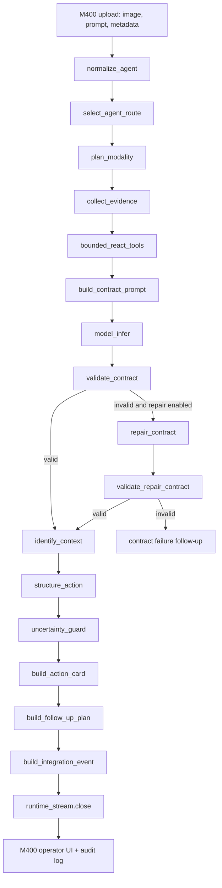

# Lao-shi-fu Maintenance Agent POC Record

Date: 2026-05-13

This document records the first complete M400-style visual POC for the WearEdge `maintenance` route, also called the `lao-shi-fu` predictive-maintenance agent. It preserves the images, Jetson results, code path, agent loop, and the engineering finding discovered during the run.

Machine scenario:

- Line: Packaging Line 3
- Asset: `PKG-L3-GBX-03`
- Cell: drive station with motor, bearing, gearbox, HMI, PLC alarm, lubrication record, and recent maintenance record
- Route: `analysis_mode=maintenance`
- Gateway: Jetson `/v1/infer`
- Token used in POC: `wearedge-demo-2026`
- Runtime: Gemma 4 E2B through llama.cpp, visual token budget `560/560`

## Goal

The goal was to validate a realistic multi-turn M400 workflow:

1. M400 captures a machine-condition image.
2. Jetson locks the request to the maintenance route.
3. The agent asks for follow-up evidence instead of guessing final root cause.
4. Operator captures the requested photos.
5. Operator gives sensory feedback: noise, odor, heat, vibration, leakage.
6. Jetson returns a bounded maintenance action card and integration event.

This POC intentionally does not test the `hazard` route. Personnel exposure, PPE, blocked walkways, fall risk, pinch risk, and restricted-zone exposure belong to the Hazard Exposure agent.

## Preserved Artifacts

Photos are stored in:

```text
docs/assets/lao-shi-fu-maintenance-poc/
```

Machine-readable POC summary is stored in:

```text
docs/poc-results/lao-shi-fu-maintenance-poc-summary.json
```

Raw runtime files from the original run remain under `runtime/complete-lao-shi-fu-run*`, but this document does not depend on `runtime/` for the photos or summary.

## M400 Image Sequence

### 0. Initial Full Frame


Purpose:

- Capture asset identity, station context, HMI values, vibration RMS/trend, temperature gauges, PLC yellow alarm, oil staining, and belt/guard condition in one image.

Jetson result:

- `machine`: `PKG-L3-GBX-03 (Packaging Line 3)`
- `symptom`: motor temperature around `78C`, vibration around `7.8 mm/s`, visible warning context
- `channel`: `schedule_maintenance`
- `priority`: `medium`
- `owner`: `maintenance_planner`

Final-code recheck result:

- `channel`: `condition_inspection`
- `priority`: `low`
- `owner`: `operator`
- `action`: `Inspect ...`

Interpretation:

- The first frame is enough to request condition inspection or planning, but not enough to prove final severity by itself.
- This is the desired behavior. The model should ask for follow-up evidence rather than claim a root cause.

### 1. Asset Identity Photo


Purpose:

- Confirm station and equipment identity.
- Prevent a maintenance recommendation from being attached to the wrong machine.

Jetson result:

- `machine`: `M400 Packaging Line 3 Drive Station, Asset ID PKG-L3-GBX-03`
- `channel`: `condition_inspection`
- `priority`: `low`
- `owner`: `operator`

Interpretation:

- Identity was confirmed.
- The action stayed bounded because this image mostly proves identity, not severity.

### 2. Condition Screen Photo


Purpose:

- Capture vibration RMS/trend, current, load, speed, and PLC yellow alarm.

Jetson result:

- `symptom`: vibration RMS around `7.8 mm/s`, bearing vibration alarm, high load state
- `channel`: `maintenance_stop`
- `priority`: `critical`
- `owner`: `maintenance_engineer`

Interpretation:

- The status screen moved the agent from general inspection into a stop-and-check maintenance decision.
- This is triggered by machine-condition evidence, not by EHS hazard logic.

### 3. Temperature Gauge Photo


Purpose:

- Capture motor, bearing, and gearbox temperatures.

Jetson result:

- `symptom`: motor around `82C`, bearing around `78C`, gearbox around `91C`, yellow PLC alarm
- `channel`: `maintenance_stop`
- `priority`: `critical`
- `owner`: `maintenance_engineer`

Interpretation:

- Temperature evidence confirms the condition-monitoring concern.
- The agent correctly asks for technician confirmation rather than declaring a final root cause.

### 4. Lubrication Record Photo


Purpose:

- Check whether lubrication history supports the heat, vibration, and oil-staining observations.

Jetson result:

- `symptom`: high vibration, high temperature evidence, yellow alarm, possible lubrication concern
- `channel`: `condition_inspection`
- `priority`: `low`
- `owner`: `operator`

Interpretation:

- In this single photo turn, the agent treated the record as follow-up evidence and stayed in inspection mode.
- In the accumulated evidence chain, this record supports maintenance escalation when paired with live condition and sensory evidence.

### 5. Recent Maintenance Record Photo


Purpose:

- Check whether the same asset had recent open vibration, noise, leakage, or follow-up items.

Jetson result:

- `symptom`: record indicates recurring abnormal machine condition context
- `channel`: `maintenance_stop`
- `priority`: `critical`
- `owner`: `maintenance_engineer`

Interpretation:

- Historical maintenance context prevents the agent from treating the image as an isolated observation.
- This is the pattern we want later from a real CMMS/work-order tool.

### 6. Operator Sensory Check


Simulated operator answer:

```text
齿轮箱附近有高频尖叫声，淡淡焦油味；箱体温度比平时高，
护罩有肉眼可见抖动；齿轮箱底部有小油渗；约 13:40 午后启动后出现；
无烟、无红灯、无急停；当前降速等待维修。
```

Final Jetson result:

- `machine`: `包装线 3 号驱动站 (Packaging Line 3 Drive Station)`
- `symptom`: high-pitched gearbox noise, faint burnt-oil smell, higher-than-normal housing heat, visible guard shaking, small oil seepage
- `maintenance_risk`: possible serious bearing, gearbox, transmission, or lubrication degradation risk
- `evidence_needed`: vibration spectrum, temperature trend, lubrication details, oil leakage quantification
- `action`: `Stop 立即安排技术人员对驱动站进行详细的停机检查，重点检查润滑情况、油液泄漏点以及振动源的定位和初步诊断。`
- `channel`: `maintenance_stop`
- `priority`: `critical`
- `owner`: `maintenance_engineer`
- `integration_target`: `maintenance_work_order`
- `runtime_stream.closed`: `true`

Interpretation:

- With live condition evidence plus operator sensory evidence, the agent correctly escalated to a critical maintenance stop.
- It still did not claim final root cause. It asked for technician inspection and quantified follow-up evidence.

## Result Summary

| Step | Capture | Contract | Repaired | Channel | Priority | Owner | Runtime closed |
| ---: | --- | --- | --- | --- | --- | --- | --- |
| 0 | initial full frame | true | false | `schedule_maintenance` | medium | `maintenance_planner` | true |
| 1 | asset identity | true | false | `condition_inspection` | low | `operator` | true |
| 2 | condition screen | true | false | `maintenance_stop` | critical | `maintenance_engineer` | true |
| 3 | temperature gauges | true | false | `maintenance_stop` | critical | `maintenance_engineer` | true |
| 4 | lubrication record | true | false | `condition_inspection` | low | `operator` | true |
| 5 | recent work record | true | false | `maintenance_stop` | critical | `maintenance_engineer` | true |
| 6 | operator sensory check | true | false | `maintenance_stop` | critical | `maintenance_engineer` | true |

Final code recheck after deploying the narrowed action-starter normalization to Jetson:

| Check | Contract | Channel | Priority | Owner | Action starter |
| --- | --- | --- | --- | --- | --- |
| initial full frame | true | `condition_inspection` | low | `operator` | `Inspect` |
| operator sensory check | true | `maintenance_stop` | critical | `maintenance_engineer` | `Stop` |

## Code Path

The POC request enters WearEdge through the FastAPI gateway:

```text
M400 image + prompt
  -> POST /v1/infer
  -> jetson/app.py::infer
```

Gateway responsibilities in `jetson/app.py`:

1. Validate `Authorization: Bearer ...`.
2. Normalize `analysis_mode`.
3. Build `device_context` and request id.
4. Read the uploaded image.
5. Call `run_m400_agently_workflow(...)`.
6. Reject invalid model output with HTTP `502`.
7. Build the final response body.
8. Append audit event.

The orchestration entrypoint is:

```text
jetson/agently_orchestrator.py::run_m400_agently_workflow
```

The workflow calls the following local modules:

| File | Responsibility |
| --- | --- |
| `jetson/agent_profiles.py` | Normalize aliases such as `lao-shi-fu`, `pm`, and `maintenance_agent` into `maintenance`. |
| `jetson/agent_loop.py` | Route selection, action decision, context guard, action card, integration event, and agent-loop metadata. |
| `jetson/evidence_plan.py` | Declare current evidence sources and missing external evidence tools. |
| `jetson/tool_plan.py` | Run bounded ReAct-style tool planning and log missing tools without hallucinating their results. |
| `jetson/modality_pipeline.py` | Build image-token and audio-fusion plan before inference. |
| `jetson/output_contract.py` | Build mode-specific prompt contract, parse structured model output, validate required fields, and normalize action starters. |
| `jetson/follow_up_plan.py` | Produce deterministic M400 follow-up capture requests. |
| `jetson/audit_log.py` | Persist audit and recent-agent-run records. |

## Agent Loop

The industrial agent loop is intentionally not an open-ended chat loop. It is a bounded Agently-style workflow:



Stage behavior in this POC:

| Stage | Behavior |
| --- | --- |
| `normalize_agent` | `analysis_mode=maintenance` is resolved to the lao-shi-fu maintenance route. |
| `select_agent_route` | Locks the request to machine-condition predictive maintenance. EHS hazard analysis is not allowed in this route. |
| `plan_modality` | Confirms visual token budget and multimodal runtime settings. |
| `collect_evidence` | Marks `m400_image`, `device_context`, `ocr_attention`, and `high_detail_visual` as current sources. |
| `bounded_react_tools` | Declares missing tools such as asset registry, telemetry history, manual KB, and work-order history. No fake tool result is invented. |
| `build_contract_prompt` | Adds the maintenance output contract and route boundary to the prompt. |
| `model_infer` | Sends one multimodal model request to llama.cpp. |
| `validate_contract` | Requires `Machine`, `Symptom`, `Maintenance Risk`, `Evidence Needed`, and `Action`. |
| `repair_contract` | Runs at most one repair call if the first output fails the contract. |
| `identify_context` | Checks whether required context is known or blocked. |
| `structure_action` | Converts model fields into deterministic channel, owner, and human gate. |
| `uncertainty_guard` | Blocks low-control actions when machine identity or evidence is insufficient. |
| `build_action_card` | Builds operator-facing message, priority, owner, confirmations, and integration target. |
| `build_follow_up_plan` | Emits M400 follow-up captures when evidence is still needed. |
| `build_integration_event` | Wraps the action card and evidence into a CMMS-ready event envelope. |
| `close_execution` | Closes the runtime stream and returns traceable outputs. |

## Deterministic Rules Validated

Maintenance route boundary:

- The maintenance agent does not analyze EHS/personnel exposure.
- Hazard words alone do not escalate maintenance severity.
- Machine-condition indicators drive maintenance severity.

Action mapping:

- `Stop ...` maps to `maintenance_stop`, owner `maintenance_engineer`, priority `critical`.
- `Schedule ...` maps to `schedule_maintenance`, owner `maintenance_planner`, priority `medium`.
- `Inspect ...` can remain `condition_inspection` unless severity markers force escalation.
- Yellow/amber PLC alarm plus condition evidence maps to maintenance reporting or stop behavior depending on model action and severity evidence.

Follow-up behavior:

- The first frame can request more evidence.
- Required evidence includes asset identity, condition screen, temperature gauges, lubrication record, recent work record, and operator sensory check.
- The model is not allowed to claim final root cause before enough evidence is gathered.

## Engineering Finding And Fix

During the first real Jetson run, the model returned a semantically good Chinese action:

```text
立即对驱动电机和输送机构的润滑状态进行彻底的目视检查...
```

The output failed the contract because the `Action` line did not start with one of the allowed deterministic starters:

```text
Inspect, Monitor, Schedule, Stop, Report, Escalate, Keep
```

Fix:

- `jetson/output_contract.py` now normalizes clear Chinese action starters into deterministic English starters.
- Example: `立即...目视检查...` becomes `Inspect 立即...目视检查...`.
- Example: `立即安排...停机检查...` becomes `Stop 立即安排...停机检查...`.
- The normalization is intentionally narrowed: unsupported English actions such as `Move boxes quickly` are still rejected.

Regression coverage:

- Added test: Chinese maintenance action starter normalization.
- Full local test suite result after the fix: `77 passed`.
- Jetson gateway was updated and restarted.
- Final recheck on Jetson returned HTTP `200` for both initial-frame and final sensory-check requests.

## Current Limitations

- The current `/v1/infer` endpoint is still a single-image request interface.
- This POC simulated multi-turn M400 state by carrying accepted evidence summaries in the prompt.
- Real production should persist a request family/session id so Jetson can manage accumulated evidence without prompt stuffing.
- Asset registry, vibration history, manual KB, lubrication records, and work-order history are still declared as missing tools. They are not yet connected live.
- Final root cause remains out of scope for the vision model. It should come from technician inspection, telemetry history, manual thresholds, and CMMS records.

## Next Engineering Step

Convert this POC from prompt-carried evidence into a real multi-turn evidence session:

```text
POST /v1/sessions
POST /v1/sessions/{id}/evidence
POST /v1/sessions/{id}/infer
GET  /v1/sessions/{id}/trace
```

This will let M400 upload each photo and sensory answer as separate evidence objects while Jetson owns the accumulated state, audit trail, and final action card.
