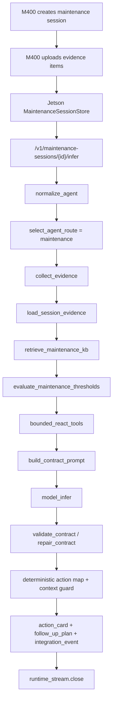

# Lao-shi-fu Maintenance Session Evidence Loop

本文档记录 WearEdge lao-shi-fu predictive-maintenance agent 的多轮 POC loop。目标是让 M400 不再只做“单张照片问模型”，而是把资产身份、HMI/condition screen、温度表、润滑记录、近期维修记录和操作员感官观察逐步上传到 Jetson，由 Jetson 在同一个 maintenance session 中累积证据，再执行受控推理。

## Why

预测性维护不能靠单帧图片直接给最终根因、RUL 或重启许可。现场真正可用的 loop 应该像老师傅排查设备一样推进：

1. 先确认是不是同一台机、同一工位。
2. 读取可见异常和条件监测信息。
3. 要求操作员补拍记录和仪表。
4. 接收操作员对异响、异味、发热、抖动、漏油和开始时间的反馈。
5. 最后只输出受证据约束的 action card，例如 `condition_inspection`、`maintenance_report`、`maintenance_escalation` 或 `schedule_maintenance`。

## Runtime Path



`load_session_evidence` 是新增的 Agently/TriggerFlow-style stage。没有 session 时它会被标记为 `skipped`；有 session 时它会把已接受证据、需要人工确认的证据和仍缺失的 follow-up evidence 注入模型 prompt，并写入 `agently_trace` 与 `runtime_stream`。

`retrieve_maintenance_kb` 是 lao-shi-fu agent 的本地 RAG/KB stage。当前 POC 使用 `data/maintenance_kb/pkg_l3_gbx_03.json` 作为 PKG-L3-GBX-03 的预测性维护知识库，检索振动 RMS、温度、润滑、报警和操作员感官观察相关章节，并把来源片段注入 prompt。后续可以把同一 stage 的实现替换成 Agently embedding-agent + Chroma collection，但返回给 M400 的 `knowledge_base`、`agently_trace` 和 `runtime_stream` 契约保持不变。

`evaluate_maintenance_thresholds` 是 lao-shi-fu agent 的确定性判断 stage。它不调用模型，而是读取 session 中 accepted evidence 的结构化字段，例如 `vibration_rms_mm_s=7.2`、`gearbox_temperature_c=78`、`alarm_code=GBX-VIB-HI`，再和 RAG 命中的 KB 阈值比对，产出 `maintenance_evaluation.breaches[]`。模型只负责在这些证据边界内解释和组织建议，不能覆盖阈值判断。

## Evidence Types

当前 POC 固定使用这些维护证据 ID：

| Evidence ID | Capture | 说明 |
| --- | --- | --- |
| `maintenance_asset_identity_photo` | photo | 设备 ID 铭牌、工位指示牌、线体/工位编号。 |
| `maintenance_condition_screen_photo` | photo | HMI、PLC 报警、condition monitor、振动 RMS/趋势、电流、负载、转速。振动 RMS 本身应来自振动传感器、状态监测模块、PLC/SCADA 或手持测振仪，M400 只负责拍摄显示结果。 |
| `maintenance_temperature_gauge_photo` | photo | 电机、轴承、齿轮箱温度表或热像/测温枪读数。 |
| `maintenance_lubrication_record_photo` | photo | 机台旁润滑记录、点检卡、加油/换油记录。 |
| `maintenance_recent_work_record_photo` | photo | 最近维修记录、故障记录、换件记录、工单摘要。 |
| `maintenance_operator_sensory_check` | operator_note | 异响、异味、发热、抖动、漏油、开始时间、是否随负载变化等操作员观察。 |

证据状态受控为：

```text
accepted
missing
unclear
conflicts_with_previous
requires_human_confirm
```

只有 `accepted` 会被当作可用证据；`unclear`、`conflicts_with_previous` 和 `requires_human_confirm` 会进入 prompt 的 “Evidence requiring confirmation” 区域，禁止模型把它们当成最终确认。

## API

### Create Session

```text
POST /v1/maintenance-sessions
Authorization: Bearer <DEMO_TOKEN>
Content-Type: multipart/form-data
```

Form fields:

| Field | Required | Notes |
| --- | --- | --- |
| `device_id` | no | M400 device id. |
| `frame_ts` | no | Device-side timestamp. |
| `location_hint` | no | Line, station, or cell. |
| `capture_mode` | no | Defaults to `maintenance-session`. |
| `operator_id` | no | Operator or demo user id. |
| `initial_prompt` | no | Initial investigation goal. |

Response includes:

```json
{
  "ok": true,
  "maintenance_session": {
    "version": "wear-edge-maintenance-session.v1",
    "session_id": "...",
    "mode": "maintenance",
    "status": "open",
    "evidence_state": {
      "count": 0,
      "accepted_evidence_ids": []
    }
  }
}
```

### Add Evidence

```text
POST /v1/maintenance-sessions/{session_id}/evidence
Authorization: Bearer <DEMO_TOKEN>
Content-Type: multipart/form-data
```

Form fields:

| Field | Required | Notes |
| --- | --- | --- |
| `evidence_type` | yes | One of the maintenance evidence IDs above. |
| `capture_type` | no | `photo`, `operator_note`, or another bounded source label. |
| `status` | no | Defaults to `accepted` when image or summary exists. |
| `summary` | no | Human-readable evidence summary. |
| `fields_json` | no | Optional JSON object with structured readings, for example `{"gearbox_temp_c":"78","vib_rms_mm_s":"7.2"}`. |
| `request_id` | no | Previous inference request id, when evidence answers a follow-up task. |
| `image` | no | JPEG/PNG evidence photo. Not needed for sensory note. |

The endpoint does not require a model call. It only records session evidence and returns the updated session state.

### Infer With Session Evidence

```text
POST /v1/maintenance-sessions/{session_id}/infer
Authorization: Bearer <DEMO_TOKEN>
Content-Type: multipart/form-data
```

This endpoint is maintenance-only. It reuses the same inference engine as `/v1/infer`, but forces `analysis_mode=maintenance` and injects `build_workflow_session_context(session)` into the workflow.

Important response fields:

| Field | Meaning |
| --- | --- |
| `agently_trace.triggerflow.stages[].name=load_session_evidence` | Shows whether session evidence was loaded. |
| `follow_up_plan.requests` | Remaining evidence tasks M400 should collect. |
| `maintenance_session.missing_requested_evidence_ids` | Requested evidence that is not yet accepted. |
| `action_card` | Deterministic operator-facing maintenance action package. |
| `integration_event` | CMMS/work-order event envelope draft. |
| `knowledge_base` | Retrieved machine-specific predictive-maintenance KB sections, including source revision, section id, score and content snippet. |
| `maintenance_evaluation` | Deterministic comparison of accepted session readings against retrieved KB thresholds, including breach list and recommended channel. |

### Trace Session

```text
GET /v1/maintenance-sessions/{session_id}/trace
Authorization: Bearer <DEMO_TOKEN>
```

Returns the session, evidence state, and chronological session events:

```text
maintenance_session.created
maintenance_session.evidence_added
maintenance_session.inference_completed
```

## Prompt Injection Contract

The session context added to the model prompt has this shape:

```text
Maintenance session evidence context:
- Session ID: ...
- Device: ...
- Accepted evidence:
  - maintenance_asset_identity_photo: ...
  - maintenance_operator_sensory_check: ...
- Evidence requiring confirmation:
  - maintenance_temperature_gauge_photo [requires_human_confirm]: ...
- Missing requested evidence:
  - maintenance_recent_work_record_photo
Session rules:
- Treat accepted evidence as belonging to the same machine investigation unless it conflicts with new evidence.
- Do not claim final root cause, remaining useful life, restart permission, or maintenance release without trusted tool/manual evidence.
- If evidence is missing or unclear, ask for targeted M400 follow-up rather than guessing.
```

The model sees the evidence, but final action routing still happens in deterministic Python rules after contract validation. This preserves the industrial boundary: ReAct/tool context can help gather and explain evidence, while release, escalation, CMMS event routing and human confirmation remain controlled.

## Maintenance KB / RAG

Current local KB seed:

```text
data/maintenance_kb/pkg_l3_gbx_03.json
```

It contains machine-specific sections:

| Section | Purpose |
| --- | --- |
| `GBX-VIB-01` | Gearbox vibration RMS escalation with yellow PLC alarm. |
| `GBX-TEMP-01` | Gearbox and bearing temperature confirmation. |
| `GBX-LUBE-01` | Lubrication record, oil smell and leak cross-check. |
| `GBX-HUMAN-01` | Operator sensory observation handling. |

The workflow treats this as retrieved reference evidence:

- `manual_kb` is now an available RAG tool in the bounded tool plan.
- `retrieve_maintenance_kb` records matched section IDs in `agently_trace`.
- `knowledge_base.status=matched` and `knowledge_base.hits[]` are returned in the inference response.
- KB-level structured thresholds are returned in `knowledge_base.thresholds`, for example vibration RMS high limit, gearbox/bearing temperature limits, PLC alarm code and lubrication interval.
- `evaluate_maintenance_thresholds` converts accepted session fields plus KB thresholds into `maintenance_evaluation.status`, `risk_level` and `breaches[]`.
- KB evidence can strengthen maintenance risk and evidence-needed wording, but cannot authorize final root cause, RUL, restart permission or maintenance release.

The local implementation follows the same engineering shape as `industrial-rag-agent`: explicit search stage, bounded result count, source/citation-like IDs, evidence gate semantics, and downstream contract validation. It is intentionally lightweight for Jetson POC; the `retrieve_maintenance_kb` stage can later swap to the `industrial-rag-agent` sparse index, embedding-agent, or Chroma collection without changing the M400 response contract.

## Performance Notes

The 48-second POC latency is mostly inference-bound, not storage-bound. The 2TB SSD is useful for model files, KB indexes, logs, cached images, and larger RAG collections, but it does not materially increase token generation speed. The current slow path combines:

- Orin Nano-class compute and memory bandwidth.
- `llama.cpp` multimodal inference with Gemma E2B.
- 560 visual tokens for OCR/small-text reading.
- A 2.66 MB PNG final frame.
- One full model answer with structured contract validation.

The next optimization is a two-speed maintenance mode: after the six evidence items are already in session state, final inference can use retrieved evidence plus a smaller confirmation frame, or even a text-only/session-context pass when no new visual detail is needed.

## POC Operator Sequence

For the current lao-shi-fu POC, run the field flow in this order:

1. Create maintenance session.
2. Upload `maintenance_asset_identity_photo`.
3. Upload `maintenance_condition_screen_photo`.
4. Upload `maintenance_temperature_gauge_photo`.
5. Upload `maintenance_lubrication_record_photo`.
6. Upload `maintenance_recent_work_record_photo`.
7. Upload `maintenance_operator_sensory_check` with fields such as noise, smell, heat, vibration, leakage, load condition and start time.
8. Call `/v1/maintenance-sessions/{session_id}/infer`.
9. Read `action_card`, `follow_up_plan`, `maintenance_session.evidence_state` and `runtime_stream.closed`.

Jetson 上可以用脚本复验同一条路径：

```bash
cd ~/WearEdge-Pro
source .env
chmod +x scripts/*.sh
DEMO_TOKEN="$DEMO_TOKEN" scripts/run_maintenance_session_poc.sh
```

`scripts/run_maintenance_session_poc.sh` waits for `/healthz` before it starts creating the session. Default wait is 60 seconds, because right after `sudo systemctl restart wearedge-gateway.service`, uvicorn may need a few seconds before port `8081` is listening. To extend this during demos:

```bash
GATEWAY_WAIT_SECONDS=90 DEMO_TOKEN="$DEMO_TOKEN" scripts/run_maintenance_session_poc.sh
```

脚本默认使用 `docs/assets/lao-shi-fu-maintenance-poc/` 下的 POC 图片，也可以通过环境变量替换任一图片：

```bash
ASSET_DIR=/path/to/maintenance-poc-images \
INITIAL_IMAGE=/path/to/00_initial_full_frame.png \
DEMO_TOKEN="$DEMO_TOKEN" \
scripts/run_maintenance_session_poc.sh
```

Example sensory note:

```json
{
  "noise": "low-frequency abnormal rumble near gearbox",
  "smell": "slight warm oil smell",
  "heat": "gearbox housing feels warmer than usual but not burning hot",
  "vibration": "operator feels stronger vibration on guard panel",
  "leakage": "small oil stain near gearbox base",
  "started_at": "after speed increase during current shift"
}
```

## Test Coverage

Current automated coverage:

- `tests/test_maintenance_session.py`
  - session creation
  - accepted and confirmation-required evidence
  - missing requested evidence calculation
  - prompt context generation
  - invalid evidence status rejection
  - maintenance-only mode guard
- `tests/test_agently_orchestrator.py`
  - `load_session_evidence` appears in exported flow definition
  - session context is inserted into model prompt
  - trace records session id, accepted evidence count, and missing requested evidence
- `tests/test_maintenance_session_api.py`
  - creates a session through FastAPI
  - uploads six accepted evidence items through the HTTP contract
  - runs session inference with a fake model response
  - verifies `load_session_evidence`, `knowledge_base.status=matched`, `maintenance_evaluation.status=breach_detected`, empty repeated follow-up requests, runtime close, and trace event
- `tests/test_maintenance_kb.py`
  - retrieves PKG-L3-GBX-03 vibration and temperature sections from the local KB
  - verifies no-match behavior keeps manual-threshold claims blocked
- `tests/test_maintenance_signal_eval.py`
  - compares accepted session readings against KB thresholds
  - verifies vibration, temperature, PLC alarm and lubrication interval breaches are audit-visible
- `scripts/run_maintenance_session_poc.sh`
  - creates a maintenance session
  - uploads the six POC evidence items in order
  - runs session inference through Jetson gateway
  - verifies `load_session_evidence`, `knowledge_base.status=matched`, `maintenance_evaluation.status=breach_detected`, action card, integration event, runtime close, and session trace

Verification command:

```powershell
& "C:\Users\ryan hui\anaconda3\python.exe" -m pytest
```

Last local result:

```text
86 passed
```
