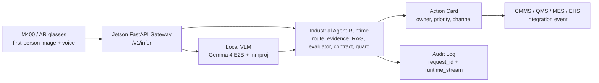

# WearEdge Pro

**可穿戴边缘工业多模态 AI Agent 系统**

[](LICENSE)
[](http://makeapullrequest.com)

WearEdge Pro 面向工业一线，把 **M400 / AR 第一视角采集**、**Jetson 本地多模态推理**、**工业 RAG / 规则** 和 **可审计 Agent 编排** 组合成一个可穿戴边缘 AI runtime。它的目标不是做一个“拍照问大模型”的 demo，而是让维修、质检、转产、作业指导和安全巡检变成可追踪、可验证、可接企业系统的工业工作流。


## 一句话定位

WearEdge Pro 是工业现场的 **wearable edge agent runtime**：工人用 M400 看到现场，Jetson 在本地理解图像和上下文，Agent 编排层把模型输出约束为 action card、审计日志和 CMMS / QMS / MES / EHS 可消费事件。

## 当前阶段

项目已经从概念说明推进到可运行、可测试、可在真实 M400 和 Jetson 上复验的工程 PoC。

| 能力 | 当前状态 | 工程意义 |
| --- | --- | --- |
| Jetson 本地推理 | Gemma 4 E2B GGUF + mmproj + llama.cpp CUDA | 生产图像和现场知识默认留在边缘节点 |
| FastAPI Gateway | `/v1/infer`、健康检查、审计查询、agent flow | M400、Web、后续 AR/巡检系统共用入口 |
| 输出契约 | `scene / risk / action` 和五类 agent 字段可解析、可修正、可验证 | 下游系统不用从自然语言里猜结构 |
| 五类工业 Agent | `maintenance / iqc / changeover / wi / hazard` 共用同一 runtime | 不为单一 demo 手写逻辑，便于扩展 |
| lao-shi-fu 维护 loop | 多帧证据、资产 KB、阈值 evaluator、follow-up plan | 把老师傅排障经验拆成可验证证据链 |
| IQC detector-first | 缺陷 boxes、quality plan、deterministic disposition guard | 质量判断不只依赖 VLM 主观描述 |
| WI / Changeover source guard | 只允许 released source 支撑作业指导和转产建议 | 防止模型编造未发布 SOP |
| M400 客户端 | Camera2、JPEG 上传、gateway health、audit recent、语音触发路径 | 已进入真实可穿戴端到端链路验证 |
| 自动验收 | 本地测试记录 `122 passed`，Jetson smoke test 和真实 gateway POC 通过 | 能复验，不靠口头叙事 |

## 为什么需要 WearEdge

工业现场的问题常常发生在最后十米：工人看到了异常，但系统没有看到；系统有规则和历史记录，但现场无法免脱手调用；云端模型很强，但图像、图纸、工艺参数和维修日志不能随便出厂。

WearEdge Pro 针对三组核心矛盾：

| 现场矛盾 | 典型表现 | WearEdge Pro 的设计 |
| --- | --- | --- |
| 数据不能乱流动 | 生产图像、设备日志、质量记录和工艺信息敏感 | Jetson 本地推理，默认不上传云端模型 API |
| 决策必须低延迟 | 设备异常、质量风险和安全暴露需要现场即时响应 | M400 采集，边缘节点在局域网内完成推理和编排 |
| 工人不能脱手操作 | 维修、巡检、质检、转产时双手被任务占用 | AR 视觉入口和语音控制路径，面向现场操作习惯 |

## 系统架构



核心原则：

- **模型解释证据，不直接越权决策。** 停机、放行、转产完成、工单升级由 deterministic action map 和 guard 约束。
- **先选 agent route，再推理。** 维护、质检、转产、作业指导、安全风险各有责任边界，避免一个万能模型混合职责。
- **缺证据时要求补证据。** 资产号、HMI、温度、振动、润滑记录、缺陷检测器、released source 都是 workflow 的显式输入。
- **每次推理都能复盘。** `request_id`、`device_id`、`runtime_stream`、`action_card` 和 audit event 串成完整链路。

## 核心技术护城河：工业 Agent 编排

WearEdge Pro 的核心不在模型本身，而在模型周围的工业责任边界和编排控制面。

```text
normalize
  -> select_agent_route
  -> collect_session_evidence
  -> retrieve_RAG_or_released_source
  -> deterministic_evaluator
  -> constrained_model_reasoning
  -> output_contract_parse_and_repair
  -> uncertainty_guard
  -> action_card
  -> integration_event
  -> runtime_stream
```

| 编排层 | 做什么 | 为什么重要 |
| --- | --- | --- |
| Route boundary | 锁定 `maintenance / iqc / changeover / wi / hazard` | 防止维修、EHS、质检、转产责任混杂 |
| Evidence-first RAG | 只使用匹配资产、产品、SKU 或 released source 的证据 | 防止模型把相似但错误的工业知识套进现场 |
| Deterministic evaluator | 阈值、质量规则、source 状态在代码中执行 | 高风险判断不能只靠模型自由发挥 |
| Contract-first output | 强制结构化字段、动作起始词、bounded repair | M400 和企业系统可以稳定读取 |
| Guarded action map | owner、priority、action channel、integration target 由规则决定 | 明确人机责任边界，可审计、可测试 |
| Runtime stream | 每个 stage 和 action log 可回放 | 支撑现场复盘、调试和未来 DevTools 可视化 |

## 五类工业 Agent

| Agent route | 现场任务 | 关键证据 | 输出出口 |
| --- | --- | --- | --- |
| `maintenance` | 预测性维护、异常排查、维修升级 | 资产号、HMI、振动 RMS、温度、PLC 报警、润滑记录、操作员感官反馈 | CMMS observation / work order |
| `iqc` | 在线质量检测、缺陷 containment、放行建议 | 产品 ID、defect boxes、quality plan、sampling rule、defect catalog | QMS quality event |
| `changeover` | 转产步骤、首件验证、换型异常 | 设备 ID、SKU、released checklist、recipe / guide state | MES changeover checklist |
| `wi` | 作业指导、步骤确认、风险控制 | released WI、设备 ID、当前步骤、操作确认 | Released WI reference / deviation |
| `hazard` | 安全巡检、PPE、通道、跌倒、夹点、禁区风险 | M400 场景图、位置、capture mode、安全策略 | EHS observation / case |

## 已验证证据

| 证据链 | 位置 |
| --- | --- |
| Jetson Gemma 4 E2B 部署和模型 manifest | [`docs/e2b-deployment-runbook.md`](docs/e2b-deployment-runbook.md)、[`docs/gemma4-e2b-model-manifest.lock`](docs/gemma4-e2b-model-manifest.lock) |
| 端侧推理、输出契约和审计日志 | [`docs/technical-evidence.md`](docs/technical-evidence.md) |
| 5-agent POC 与 golden scenarios | [`docs/five-agent-poc-validation.md`](docs/five-agent-poc-validation.md) |
| lao-shi-fu 多证据维护 loop | [`docs/maintenance-session-evidence-loop.md`](docs/maintenance-session-evidence-loop.md)、[`docs/lao-shi-fu-maintenance-poc.md`](docs/lao-shi-fu-maintenance-poc.md) |
| M400 真实佩戴与 Jetson field loop | [`docs/poc-results/m400-worn-comparison-20260520-181119/field-test-summary-20260520-181119.md`](docs/poc-results/m400-worn-comparison-20260520-181119/field-test-summary-20260520-181119.md) |
| 网络问题、镜像策略和部署排障 | [`docs/network-troubleshooting.md`](docs/network-troubleshooting.md) |
| BOM、硬件基线和功耗路线 | [`docs/core-bom.md`](docs/core-bom.md)、[`docs/hardware-baseline.json`](docs/hardware-baseline.json)、[`docs/hardware-milestones.md`](docs/hardware-milestones.md) |
| ROI 和业务影响 | [`docs/impact-and-roi.md`](docs/impact-and-roi.md) |
| 测试与部署日志 | [`docs/test-log-history.md`](docs/test-log-history.md) |

## 仓库结构

| 路径 | 说明 |
| --- | --- |
| [`.github/workflows/`](.github/workflows/) | GitHub Actions CI，用于保护 Python runtime 和 RAG 模块测试 |
| [`jetson/`](jetson/) | Jetson FastAPI gateway、agent runtime、RAG/source guard、evaluator、audit log、llama client；目录说明见 [`jetson/README.md`](jetson/README.md) |
| [`clients/`](clients/) | 现场设备客户端入口；当前重点是 [`clients/m400/`](clients/m400/) M400 Android MVP |
| [`industrial-rag-agent/`](industrial-rag-agent/) | 独立工业 RAG 模块，用于 SOP、维修手册、质检规范和日志检索 |
| [`data/`](data/) | demo 资产 KB、IQC quality plan、released WI / changeover source；目录说明见 [`data/README.md`](data/README.md) |
| [`tests/`](tests/) | agent loop、output contract、maintenance KB、IQC、released source、M400 payload 等测试；目录说明见 [`tests/README.md`](tests/README.md) |
| [`scripts/`](scripts/) | Jetson 环境、llama.cpp 编译、服务启动、smoke test 和 POC 验证脚本；目录说明见 [`scripts/README.md`](scripts/README.md) |
| [`docs/`](docs/) | 架构、部署、证据链、POC 结果、BOM、ROI 和提交材料索引；目录说明见 [`docs/README.md`](docs/README.md) |
| [`deploy/`](deploy/) | systemd 服务模板和部署配置；目录说明见 [`deploy/README.md`](deploy/README.md) |

`runtime/`、`outputs/`、模型权重、本地部署 tar 包和生成视频默认不进入 Git。长期证据应沉淀为 `docs/` 下的 Markdown / JSON / 小型截图资产。

## 快速开始

### 1. 本地测试

```powershell
cd C:\Users\ryan hui\Documents\New project\WearEdge-Pro
python -m pytest
```

### 2. Jetson 服务复验

```bash
cd ~/WearEdge-Pro
source .env

systemctl is-active wearedge-llama.service
systemctl is-active wearedge-gateway.service
curl http://127.0.0.1:8081/healthz
```

图片推理和审计 smoke test：

```bash
TEST_IMAGE=/home/ryn/WearEdge-Pro/testdata/unsafety.jpeg \
DEMO_TOKEN="$DEMO_TOKEN" \
scripts/smoke_test.sh
```

通过时应看到：

```text
llama-server text health passed.
Gateway output contract passed.
```

### 3. 5-agent POC 验证

```bash
python scripts/validate_agent_pocs.py
```

### 4. M400 Android 客户端

```powershell
cd clients\m400\android
.\gradlew.bat :app:assembleDebug --no-daemon
```

更多步骤见 [`clients/m400/README.md`](clients/m400/README.md) 和 [`clients/m400/integration-checklist.md`](clients/m400/integration-checklist.md)。

## 模型与大文件说明

模型文件不建议直接提交到 Git 仓库。当前工程通过 manifest 和本地路径管理 Gemma 4 E2B GGUF 与 mmproj 文件：

- 模型 manifest：[`docs/gemma4-e2b-model-manifest.lock`](docs/gemma4-e2b-model-manifest.lock)
- Jetson 部署说明：[`docs/e2b-deployment-runbook.md`](docs/e2b-deployment-runbook.md)
- 示例环境变量：[`.env.example`](.env.example)

本地部署包 `wearedge-pro-latest.tar` 用于 Jetson 工作区同步和现场恢复，但它是本地产物，不应直接提交到 GitHub。需要复验时按部署脚本或同步流程重新生成。

## 当前边界

- 当前项目仍是 PoC 到 pilot-ready 的工程阶段，不是已经认证的工业安全控制系统。
- 模型可以解释证据和生成建议，但生产动作必须经过 deterministic guard 与人工/系统授权。
- M400 客户端已完成真实设备链路和语音路径验证，仍需继续做发布签名、离线缓存、异常恢复、长时间佩戴体验和企业部署策略。
- 工业接入层目前以 action card / integration event 形式定义，真实 CMMS / QMS / MES / EHS 连接器仍需按客户系统开发。

## 路线图

| 阶段 | 目标 |
| --- | --- |
| Pilot 0 | 固化 Jetson + M400 端到端 demo，稳定维护和 EHS 两条高价值路径 |
| Pilot 1 | 接入真实设备台账、维修记录、质量计划和 released SOP，形成单工位闭环 |
| Pilot 2 | 加入 CMMS / QMS / MES / EHS 连接器和权限模型，支持现场工单流转 |
| Product | 多设备管理、离线缓存、审计回放、模型/规则版本治理和部署 playbook |
| Platform | 扩展到多产线、多工厂、多 agent 模块订阅和企业知识库服务 |

## 核心团队

WearEdge Pro 由许瑞安（Ryan Hui）一个人推动，通过 9 个专业 AI Agent 组成的虚拟工业团队，完成从行业调研、算法优化、硬件制造、系统开发、工业交付到商业增长的全链路闭环。

9 个 Agent 的完整代码、CLI 运行器、黑板式协作逻辑、测试用例和 GitHub Actions 已独立开源在 [`davidmillerak2026-sys/Agentic_AI_team`](https://github.com/davidmillerak2026-sys/Agentic_AI_team)。读者可以点击该仓库查看 Agent 定义、运行方式、测试与后续扩展计划。

许瑞安（Ryan Hui）是铁城科技联合创始人，拥有多年科创项目管理经验和 AI 产品商业化落地经验。过去一年内（25.8-目前），其在人工智能赛道获得多项赛事与产业认可，包括全国人工智能大赛总决赛卓越创业项目大奖、英特尔人工智能大赛全国总决赛三等奖、惠普（HP）行业大模型实践专项奖、阿里云 AI 应用火花先锋牌照、阿里妈妈最佳创作奖和阿里妈妈 AIGC 服饰营销共创官等。

| Agent | 核心职责 | 对 WearEdge Pro 的价值 |
| --- | --- | --- |
| 调研 Agent | 行业趋势、竞品分析、客户痛点、政策、论文与开源项目调研 | 帮助项目持续找到高价值场景和差异化定位 |
| 算法优化 Agent | 端侧模型量化、推理加速、VLM/RAG/结构化输出优化 | 提升本地离线模型的速度、稳定性和可部署性 |
| 分布式架构 Agent | 边缘设备、网关、云端后台、多 Agent 编排架构设计 | 支撑多设备、多产线、多工厂的企业级扩展 |
| 全栈开发 Agent | Web 控制台、API、CLI、数据后台、演示 Demo 开发 | 把技术能力快速变成可体验、可交付的软件系统 |
| 硬件可制造性 Agent | BOM、功耗、散热、结构、供应链、量产风险评估 | 确保可穿戴设备从原型走向可量产产品 |
| 工业场景产品化 Agent | SOP、质检、巡检、维修、工单、MES/SCADA 接入设计 | 把 AI 能力转化为真实工厂可用的业务流程 |
| 合规与安全认证 Agent | 数据安全、本地化部署、工业安全规范、认证材料、客户合规问答 | 解决工业客户进厂、过审、交付和责任边界问题 |
| 销售 BD 与客户成功 Agent | PoC 方案、ROI 测算、报价单、客户访谈、试点复盘、招投标材料 | 把技术试点转化为订单和长期客户关系 |
| 自媒体与融资叙事 Agent | GitHub、公众号、短视频脚本、路演稿、BP、投资人问答 | 放大项目影响力，持续吸引客户、伙伴和资本 |

## 许可证

本项目采用 [MIT License](LICENSE)。欢迎通过 Issue 或 Pull Request 交流工业边缘 AI、RAG、Agent 编排和可穿戴人机协作的落地方案。
